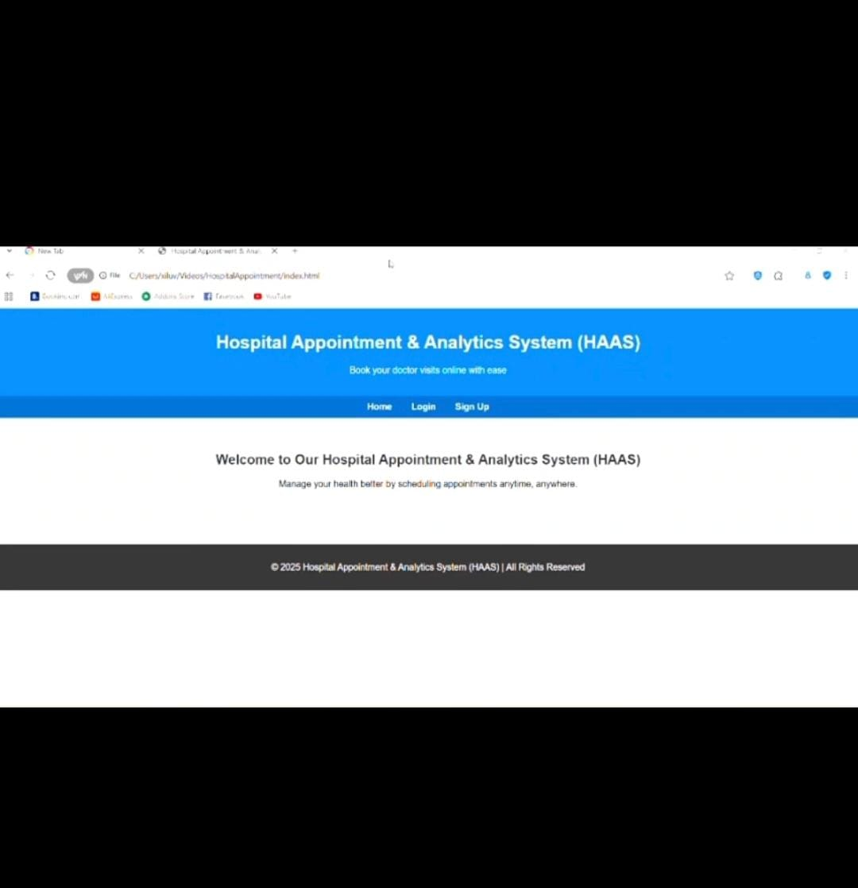

# portfolio_Term4

#  Sinhle Xiluva Mthethwa
**xiluvasinhlemthethwa@gmail.com**

### Cape Peninsula University of Technology  
**Diploma in Information Technology**
**Applications Developer**
**Student no 221802797**

---

##  About Me

Motivated and detail-oriented App Developer passionate about building intuitive **web and mobile applications** that improve everyday life.  

I specialize in both **front-end and back-end development**, using languages and frameworks such as **Java, JavaScript, React, C++, HTML**, and **MySQL**. I am committed to writing **clean, scalable, and efficient** code that enhances user experience and solves real-world problems.

Currently pursuing a **Diploma in Information Technology** at the Cape Peninsula University of Technology, majoring in **Application Development**.

---

## About Me(Mork Interview) – Short Video  
[*(Video embedded in original digital portfolio)*](https://github.com/Sinhle221/Mock-Interview-/blob/main/Mock%20video.mp4)

---

# EXPERIENCE

## **App Developer Intern — Bankseta (Plum Systems)**  
**2025 – Present**

### Responsibilities & Experience  
- Front-end and back-end development for **web** and **mobile** applications  
- API integration and UI component development  
- Code transfer, code optimization, and system integration  
- Strengthened ability to work within production-level systems  
- Improved understanding of software development cycles and teamwork  

---

# Workplace Experience & Growth

Working at Plum Systems has helped me grow both **technically and personally**:

### Communication & Collaboration  
- Learned to communicate clearly in a team environment  
- Improved confidence in asking for help and seeking clarity when needed  
- Engaged in daily meetings to provide progress updates and discuss cha
  
  
  

### Personal Development & Self-Care  
- Learned the importance of balancing productivity with mental well-being  
- Practiced managing workload to prevent burnout  
- Developed consistency, discipline, and resilience in fast-paced environments  

### Technical Improvements  
- Enhanced front-end and back-end development skills  
- Gained confidence working with **JavaScript, React**, and integration tasks  
- Contributed to real projects that strengthened coding efficiency and problem-solving
- 

**Note:** *I do not have any restraint of trade agreement with my current or previous employers.*

---

---
#  Education

## Cape Peninsula University of Technology  
**Diploma in Information Technology**  
*2021 – Present*

Coursework includes:  
- Application Development  
- Application Theory  
- Information Systems  
- Information Management  
- Project Management  
- Business Studies  
- Data Analysis  

Practical coding experience using **Java, JavaScript, React, C++, HTML**, and **MySQL**.

---

## Masana High School  
**National Senior Certificate**  
*2016 – 2020*

Majors: Mathematics, Life Sciences, Physical Sciences, Agriculture, Geography  
Achieved admission to a diploma-level tertiary program.

---

# Projects

### **Hospital Appointment & Analytics System (HAAS)**  
A web-based system designed to manage healthcare appointments efficiently.

### **Student Accommodation Finder**  
A React web application for searching and booking student housing.

### **NannyAtYourService Platform**  
A MySQL-powered nanny service management and analytics system.

### Project Demo  
*(Video embedded in original digital portfolio)*

---

# Professional Skills

### Technical Skills  
**Java | JavaScript | React | C++ | HTML | MySQL**  
**Time Management | Problem Solving**

---
---

### © 2025 **Sinhle Xiluva Mthethwa** | Applications Developer

---

